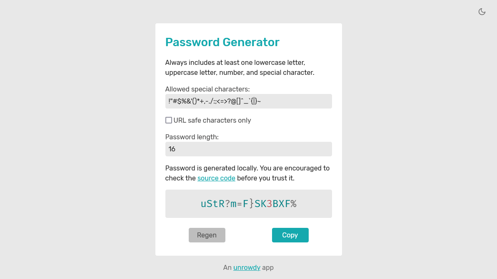

# Password Generator

To generate passwords that will actually meet the requirements of the sites you are generating them for, without having to manually tweak them.

## Features

  * Different types of characters are guaranteed, not "allowed"
  * No pointless options like "allow digits" or "allow uppercase"
  * You can copy/paste a list of allowed special characters for sites that require that
  * URL safe option in case a site really can't handle anything complicated
